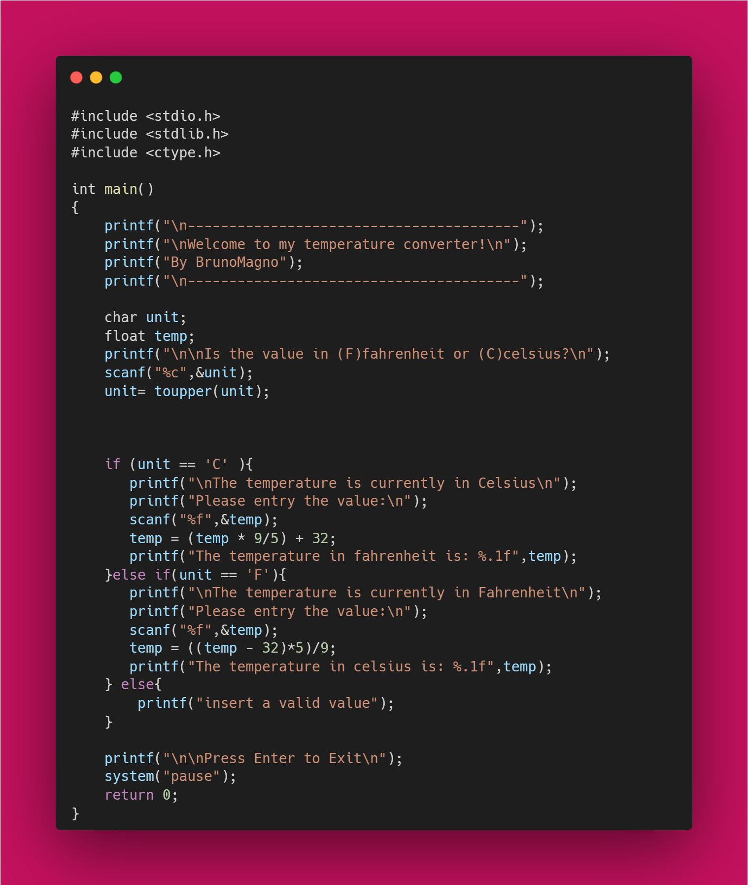

# Temperature-Coverter
This repository contains a simple <a href="temperature.c">C program</a> that converts temperature from one scale to another. The user can input a temperature value and select the desired conversion (Celsius to Fahrenheit or vice versa). The program then calculates and outputs the result.

